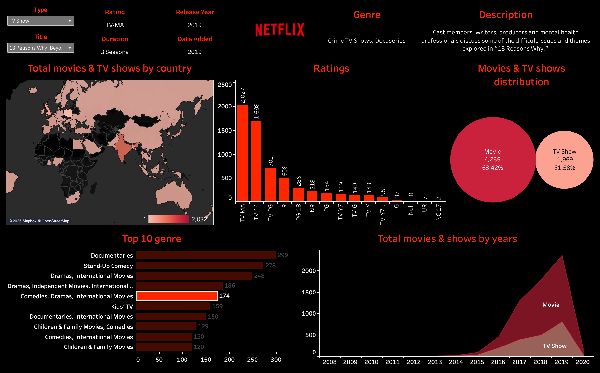

# Netflix Dashboard with Tableau

This repository contains a Tableau dashboard created using the **Netflix Titles Dataset**.  
The dashboard provides insights into Netflix content, including:

- 📅 Number of titles added each year  
- 🎬 Distribution of Movies vs TV Shows  
- 🌍 Titles by country  
- ⭐ Ratings distribution  
- ⏱ Duration of content

## 📊 Dashboard Preview

## 🔗 Live Dashboard
You can view the interactive dashboard here:  
👉 [Netflix Tableau Dashboard](https://public.tableau.com/views/Book1_17579606308420/Netflix?:language=en-US&publish=yes)

## 📂 Repository Contents
- `Netflix_Dashboard.twb` – Tableau Packaged Workbook file  
- `netflix_titles(1).csv` – Dataset used  
- `README.md` – Project documentation
- 'logo.jpeg' - Netflix logo

## 🛠 Tools Used
- Tableau Public (for visualization)  
- GitHub (for version control & sharing)  

---

✨ This project was built as a practice in **data visualization and dashboard design** using real-world data.
